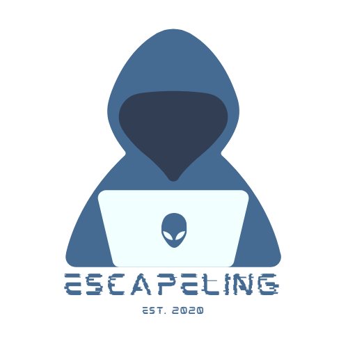

### Information about Licensing:
This Project uses the GPL-3.0 License

### Used external Materials:
In the listening task we use audio materials by the following creators. They might fall under different licensing, therefore we do not upload them and you have to download them on the creators page:
 - www.listenaminute.com
 - www.elllo.org 
 - www.esl-lounge.com
Add these files in /data/audio/
If you are unsure which files to add, checkout /data/tasks/listening/topics.json

The Vocabulary Guessing Task involves data from the following source:
*Chujo, K., Oghigian, K. and Akasegawa, S. “A corpus and grammatical browsing system for remedial EFL learners,” In A. Leńko-Szymańska and A. Boulton (eds.), Multiple Affordances of Language Corpora for Data-driven Learning. Amsterdam: John Benjamins, 2015, 109-128.*
which can be found at [www.score-corpus](https://www.score-corpus.org/en/)

The data for the sentence correction was extracted from [Cambridgeenglish.org](https://www.cambridgeenglish.org/) 

The data from the discussion task came from these [sources](https://docs.google.com/spreadsheets/d/1KUcZjonfur634mxBIwzeS82leIVBgmHkNo6XWFHeiIg/edit#gid=0).

For other used materials checkout our documentation, where we have listed all used sources in the area where they are used.

### Code for 'Adaptive Language Learning' Study Project @UOS

---

### Description

Here we will store the source code for the application.

---

### Documentation

For a more detailed and technical documentation please click [here](doc/1_Introduction.md).

---

### How to start the bot?

First, **clone the repository**. You can do this by either using the command line or a user interface like [Fork](https://git-fork.com) or [GitKraken](https://gitkraken.com) (recommended).
- Command line
  - To clone: `git clone link_to_repo`
  - To update: `git pull origin master`

Second, you have to **create or update the environment**:

- To create it: `conda env create -f environment.yml`
- To update it `conda env update --file environment.yml  --prune`

Third, **activate the environment**:

- On Windows: `activate all`
- On Linux / MacOS: `conda activate all`

Optional - **Adjust Telegram-API phone number**:

- The phone number specified in the bot.config.json file ( telegram_api[phone_number] ) must be a phone number which is registered as an active Telegram account and you have access to. Change it if neccessary.

**Start the application** using the bot which is specified in the config file:

- Start the bot: `python main.py bot.config.json`
- Start the test bot: `python main.py test_bot.config.json`
- Start your custom bot: `python main.py ..\my_custom_bot.config.json` (`..\` only if the config is outside the repository)

**Ensure Telegram-API authentication** for room creation:

- When the program asks to enter a phone number, provide the one specified in the bot.config.json file ( telegram_api[phone_number] )
- Next, paste the Telegram Login Code you received

**Start playing the game**
- search for `Escapeling` or `@Escapeling_Bot` for the deployed bot.
- search for `Escapeling (Test)` or `@test_alluos_bot` for the other bot.
- search for your own custom bot (see instructions below how to create one). When creating a new bot you should also be able to just click the link to your bot in the dialogue with the botfather (sth. like t.me/heretheactualnameofyourbot)
- enter `/start`. If the application is running with the corresponding config file in an active conda environment you should be able to start playing the game.

### Creating your own bot

If you need another bot, you can create your own bot via Telegram. Therefore you have to write a message to [BotFather](https://t.me/botfather).
1. To create a new bot send the message `/newbot`
    1. Specify the bot name
    2. Specify the bot id
    3. Save the HTTP API token. You need it later.
2. To enable that the bot can be added to groups send the message `/setjoingroups`
    1. Select your bot
    2. Send `Enable`
3. To enable the bot to read all group messages send the message `/setprivacy`
    1. Select your bot
    2. Send `Disable`
4. Create your `.config.json`-file.
    1. Copy the `bot.config.json` file and rename it to something sensible.
    2. Change the values for `bot.token` and `bot.id`
5. Either use an existing database schema (**A.**) or create a new one (**B.**)
    1. **A.** Set the `database_schema` to the schema you want to use (you can take a look at the schemas with a SQL client. See instructions below for connecting). Then you are ready to run the bot with your config file.
    2. **B.** If you want to create your own database schema set the `delete_data_and_recreate_database_schema` option to `true` and set the `database_schema` to the new name of the schema that should be created (e.g. `johnsdb`). Then run the application with your config once. The schema should show up after a refreshing your SQL client. Afterwards set `delete_data_and_recreate_database_schema` option to `false`. Otherwise the schema will be deleted and recreated every time you start running the application.

### Connecting a SQL Client to the Database

1. [Download a SQL client](https://wiki.postgresql.org/wiki/PostgreSQL_Clients#Cross-platform_GUI_Clients) which supports PostgreSQL databases and runs on your operating system.
2. Select something like 'PostgreSQL (TCP/IP)' and enter the connection data like hostname, user name, password and port. This information is listed in the bot config file under `db_connection`.
3. Below the database name you should be able to see all schemas.

### Running the discussion and listening tasks

The discussion task was updated in the third semester and now includes a Grammatical Error Correction feature for the evaluation of the task. Furthermore, the listening task was added which requires downloading audio files. To run these tasks locally, you need to use `git lfs` in order to pull the GEC model weights and the audios from the repo. You can do this as described below:

1. install [Git LFS](https://git-lfs.github.com/) by running the executable that you download from that webpage
2. run `git lfs install` on your command prompt
3. IMPORTANT: delete your local copy of the model weights / the audios from the directory, if you had them before
4. do `git fetch` und `git pull` on the branch
5. run `git lfs fetch --all`
6. run `git lfs pull`
The weights for the GEC model and the audios for the listening task will now be downloaded to the right location and will be considered tracked, so whenever you change something about them, the remote version can also be changed.

### Deprecation error
FYI: Due to the complexity of the GEC feature in the discussion task, when running the bot with the updated discussion task, a deprecation error regarding the `imp` library shows up. Fixing this error is beyond the scope of the project. However, _this deprecation error is not fatal at all and can safely be ignored._

### FAQ

1. The first time I start the bot, I am asked to enter my phone (or bot token). What do I have to enter?

   Enter the phone number that is specified in the config-file under telegram_api.phone_number. You will then be asked to enter a code that you have received. To do this you must ask someone who has access to the phone number to give you the code.

2. During the execution I get errors, for example that database tables or relationships do not exist. How can I update the database schema?

   An update of the database schema is currently not possible. To correct the error nevertheless, the database schema can be recreated. However, this will delete all data stored in the database. The standard data (for example, task data) is automatically recreated after the update. To update the database schema, the `delete_data_and_recreate_database_schema` flag must be set to `true` in the configuration file. This is also necessary the first time the application is started.

3. How do I resolve my account being spamreported for making to many create group request in a short succession? Ask the `Spam Info Bot` (`@SpamBot`) nicely to remove the limitations. After a day or so this should be resolved.

---

Icons made by <a href="https://www.flaticon.com/free-icon/bot_2235048" title="monkik">monkik</a> from <a href="https://www.flaticon.com/" title="Flaticon"> www.flaticon.com</a>

# Thanks for your Contribution
This project was only possible due to the work of:
Lucas Feldman  
Kai Dönnebrink  
Tom Hatton  
Vedant Shah  
Luis Mienhardt  
Viktoriia Schechko  
Ivan Polivanov  
Maksim Urazov  
Freya Thießen  
Maral Sheikhzadeh Beigdarvish  
Hannah Keyser  
Joana Heil  
Eunyoung Hwang  
Christian Johnson  
Emma Zanoli  
Cedric Bitschene  
Elena Korovina  
Esther Chevalier  
Frederik Wollatz  
Jannik Schmitt  
Karina Khokhlova  
Kristina Sigetova  
Liling Wu  
Malte Heyen  
Paribartan Humagain  
Polina Shamraeva  
Polina Tsvilodub  
Tobias Oberbeck  
Vera Klütz  
I. H-W. (Did not wished to be named) 
Janosch Bajorath  
Eliasz Ganning  
Hanna Linder  
Sing Yuen
 
